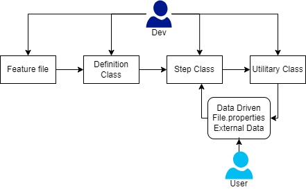

# Proyecto de Automatización con Serenity y Selenium


Este proyecto utiliza Serenity y Cucumber para la automatización de pruebas de software.

[Serenity BDD](https://serenity-bdd.github.io) proporciona un marco de trabajo BDD (Behavior-Driven Development) que simplifica la creación de pruebas automatizadas y genera informes detallados.

[Cucumber](https://cucumber.io) potencia el Desarrollo Guiado por Comportamiento (BDD). Este marco de trabajo simplifica la automatización de pruebas al permitir expresar comportamientos en un lenguaje natural.

## Diagrama de interacción



## Requisitos

- [Java JDK](https://www.oracle.com/java/technologies/javase-downloads.html) (Versión usada: Java 11)
- [Maven](https://maven.apache.org/download.cgi) (Versión usada: 1.8)
- [Eclipse](https://www.eclipse.org/downloads/) u otro entorno de desarrollo Java (opcional)
- [Serenity BDD](https://serenity-bdd.github.io) (Versión usada: 2.4.3)
- [Selenium WebDriver](https://www.selenium.dev/documentation/webdriver/) (Versión usada: 4.0.8)
- [RestAssured](https://serenity-bdd.github.io/docs/tutorials/rest) (Versión usada: 2.4.3)

## Configuración del Proyecto

1. Clona este repositorio: `git clone https://dev.azure.com/ecopetrolad/AgileDevOps/_git/WebAutomationBase`
2. Abre el proyecto en tu entorno de desarrollo (Eclipse, IntelliJ, etc.).
3. Configura las dependencias de Maven.

## Estructura del Proyecto

- **src/test/java:** Contiene los archivos fuente de las pruebas, Clases de Definition, Steps, Utilities y Runner.
- **src/test/resources:** Almacena los archivos de recursos como archivos de características de Cucumber, DataDriven, archivos de ambiente y demás.
- **target:** Directorio donde se generan los informes y otros archivos de construcción.

## Ejecución de las Pruebas

Para ejecutar las pruebas, puedes utilizar Maven. Abre una terminal en la raíz del proyecto y ejecuta:

```bash
mvn verify -{PerfilRunner} -Dcucumber.filter.tags="@TagAEjecutar" -Denvironment="Ambiente"

 *Ejemplo*
mvn verify -{BaseWebRunner} -Dcucumber.filter.tags="@Exitoso" -Denvironment="QA"
```

Se puede ejecutar el Runner directamente desde el IDE, pero esto no generará reporte de forma automatica, se deberá correr en consola desde el IDE el comando para generar las evidencias y reportes de la última ejecución

```bash
mvn serenity:aggregate
```
